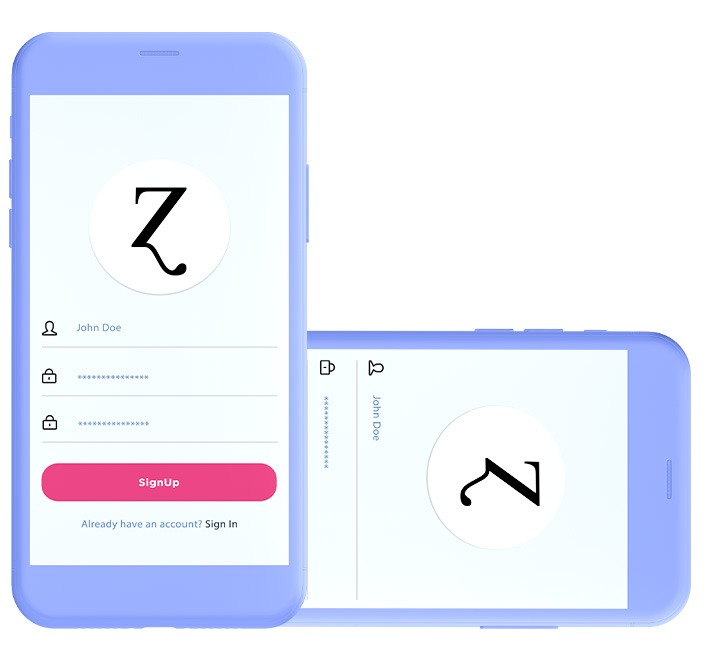
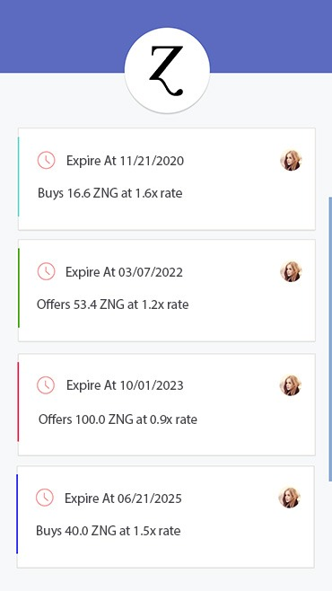
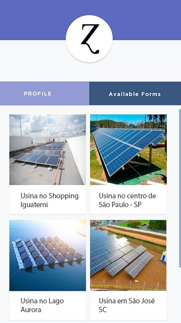
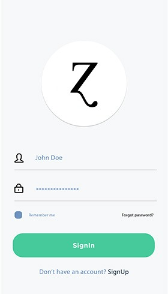
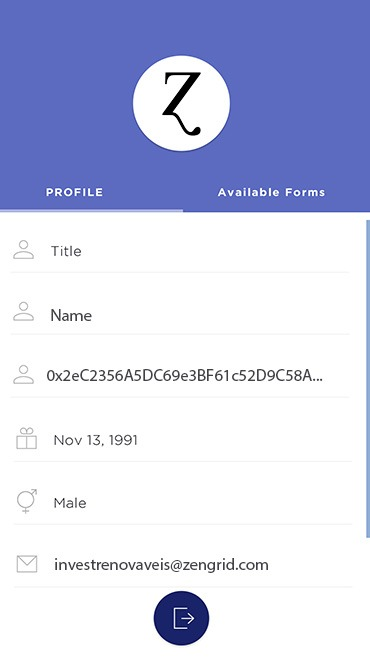

# Ɀengrid - Renewable Energy on the Blockchain 
> Blockbuilder Hackathon Winner hosted at [Softplan](https://www.softplan.com.br/)

ZenGrid is a weekend-born solution to bring energy commerce to the Blockchain. Focusing on dev speed, we a fully Pythonic stack was used (Flask, Web3.py and Infura), except for solidity contracts.

Code is extremely messy but it did the job. Deliver >>>>> bureaucracy.

Same goes for documentation (or the lack of it - sorry but not sorry). Here are some pics :P

## License

To the extent possible under law, Zengrid has waived all copyright and related or neighboring rights to this specific work.
